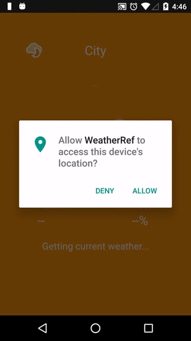

# WeatherRef
An Android application which adopts MVC pattern and supports showing the local weather.

### Demo

### Functionalities:
- Used OkHttp for transmitting network data.
- Used Google Maps API to get user's location.
- Used RESTful API from forecast.io to get weather data, and JSONObject to parse the returning JSON data.
